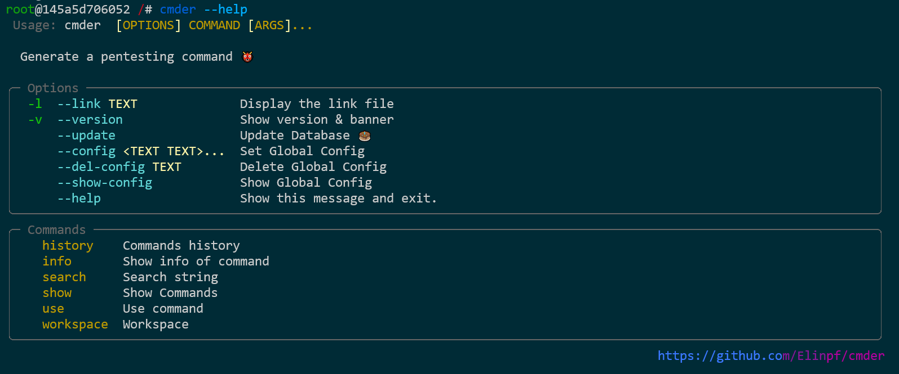
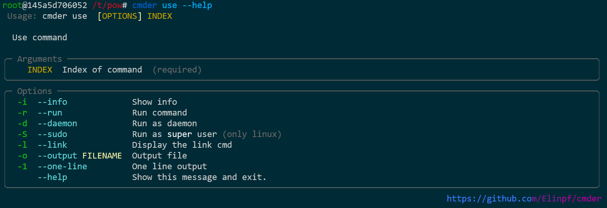
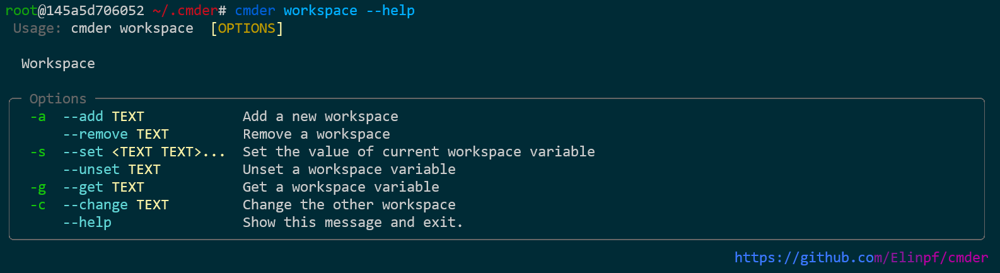

# Cmder

这是一款命令行模式下运行的命令生成框架。目标是帮助渗透测试人员快速生成测试命令。并且记录所选择的参数，方便下次使用。


# 特色

- 自定义的命令语法，可以快速添加自定义的命令。
- 自动记录上一次输入结果，并显示在推荐中
- 手动定义推荐变量
- 划分工作区
- 多行命令合并执行
- 可更新数据库

# 安装方法

```
pip3 install cmder-elinpf
```

安装完成后需要获取数据库[cmder_db](https://github.com/Elinpf/cmder_db)

```
cmder --update
```


# 使用方法





直接输入`cmder`进行查找命令，使用`cmder use <index>` 选择命令执行。


## 自定义命令

运行后会创建`~/.cmder`目录，其中`db`是用户可以自定义添加的命令文件，可以自行添加目录或者按照软件中的目录路径添加命令文件。

命令文件语法请参考[这里](https://github.com/Elinpf/cmder_db)。

## 工作区

工作区是为了方便在不同的项目中使用不同的参数环境，可以通过`cmder workspace -a <name>`添加工作区。`-c`进行切换。




## 自定义推荐

`cmder`会自动记录上一次的输入参数作为第一推荐，另外数据库中会有对相应参数的推荐，同时也可以自定义推荐，例如：

```bash
cmder workspace -s DOMAIN backdoor.htb
```

这样就添加了一个其定义参数，在后面的使用中，同一工作区内，`DOMAIN`变量就会自动推荐`backdoor.htb`。

查看所有自定义推荐：

```bash
cmder workspace -g all
```

# 灵感来源与命令来源

这个项目的灵感来源于[shellerator](https://github.com/ShutdownRepo/shellerator), 一些命令来源于以下链接：

- https://github.com/ShutdownRepo/shellerator
- https://book.hacktricks.xyz/
- https://www.ired.team/offensive-security-experiments/offensive-security-cheetsheets

# 已知BUG

## Q1 NoneType

```
$ cmder
[!] TypeError("'NoneType' object is not iterable")
```

这个问题是由于 `typer` 包的一个bug，对没有参数的命令会报错

解决方法：

1. 定位出现问题的位置

```
$ whereis cmder
cmder: /usr/local/bin/cmder

$vim /usr/local/bin/cmder
注释掉关于 TyprError 的异常处理
```

重新运行cmder，会给出完整报错日志

```
Traceback (most recent call last):
  File "/usr/local/bin/cmder", line 9, in <module>
    main.app()
  File "/usr/local/lib/python3.9/dist-packages/rich_typer/main.py", line 242, in __call__
    return get_command(self)(*args, **kwargs)
  File "/usr/local/lib/python3.9/dist-packages/click/core.py", line 1128, in __call__
    return self.main(*args, **kwargs)
  File "/usr/local/lib/python3.9/dist-packages/click/core.py", line 1053, in main
    rv = self.invoke(ctx)
  File "/usr/local/lib/python3.9/dist-packages/click/core.py", line 1637, in invoke
    super().invoke(ctx)
  File "/usr/local/lib/python3.9/dist-packages/click/core.py", line 1395, in invoke
    return ctx.invoke(self.callback, **ctx.params)
  File "/usr/local/lib/python3.9/dist-packages/click/core.py", line 754, in invoke
    return __callback(*args, **kwargs)
  File "/usr/local/lib/python3.9/dist-packages/typer/main.py", line 528, in wrapper
    use_params[k] = convertors[k](v)
  File "/usr/local/lib/python3.9/dist-packages/typer/main.py", line 501, in internal_convertor
    for (convertor, arg) in zip(convertors, param_args)
TypeError: 'NoneType' object is not iterable
```

2. 修改 typer 包的代码

进入 `/usr/local/lib/python3.9/dist-packages/typer/main.py` 的第501行，修改为：

```python
def generate_tuple_convertor(
    types: Sequence[Any],
) -> Callable[[Tuple[Any, ...]], Tuple[Any, ...]]:
    convertors = [determine_type_convertor(type_) for type_ in types]

    def internal_convertor(param_args: Tuple[Any, ...]) -> Tuple[Any, ...]:
        if not param_args:  # <--------- 加入这两行
           return tuple()   #
        return tuple(
            convertor(arg) if convertor else arg
            for (convertor, arg) in zip(convertors, param_args)
        )
    return internal_convertor
```
